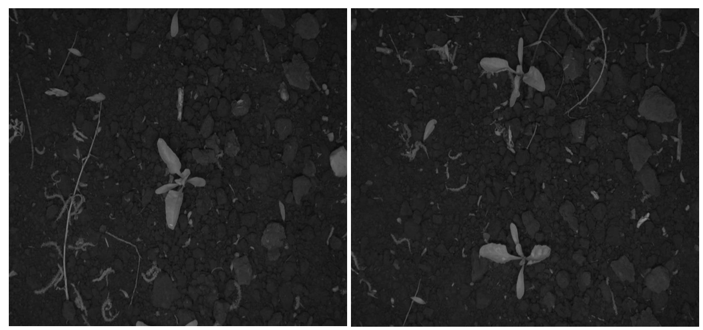
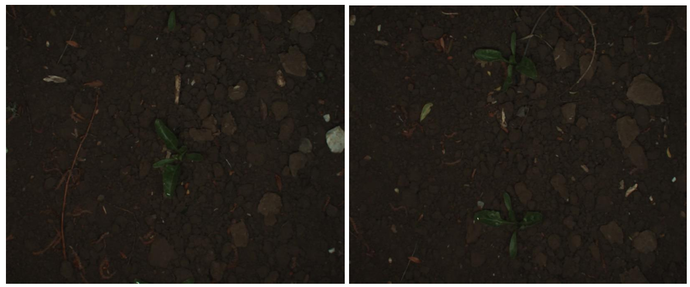
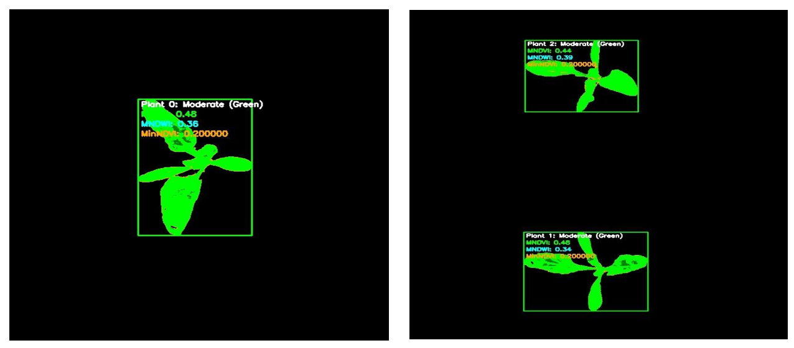
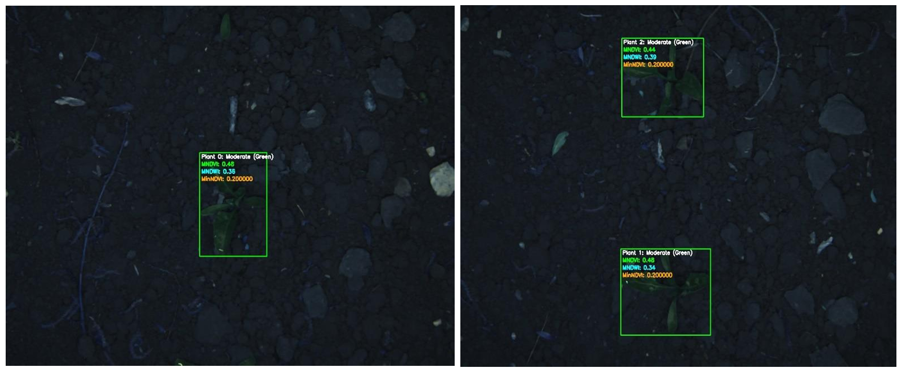
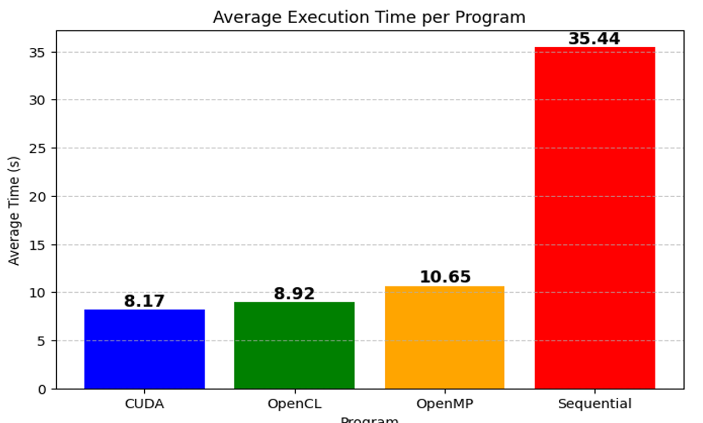

# **Automated Plant Health Analysis using Parallel Computing** 🌿

## ** Project Overview**  
This project focuses on **automated plant detection, counting, and health assessment** using **NDVI (Normalized Difference Vegetation Index) and NDWI (Normalized Difference Water Index)**. By leveraging **parallel computing techniques (CUDA, OpenCL, OpenMP)**, the system significantly speeds up image processing for large datasets.  

---

## ** Table of Contents**  
- [ Introduction](#-introduction)  
- [ Dataset](#-dataset)  
- [ Dependencies](#-dependencies)  
- [ Processing Pipeline](#-processing-pipeline)  
- [ Visualization Results](#-visualization-results)  
- [ Performance Comparison](#-performance-comparison)  

---

## ** Introduction**  
This project aims to **automate plant health analysis** by processing **RGB and NIR (Near Infrared) images** to compute vegetation indices such as **NDVI** and **NDWI**. The key features include:  

 **Automated Plant Detection & Counting** – No manual field inspection required.  
 **Parallelized Processing** – CUDA, OpenCL, and OpenMP accelerate image analysis.  
 **Precision Health Monitoring** – NDVI/NDWI values indicate plant health.  
 **Interactive Visualization** – Color-coded field representation for insights.  

---

## ** Dataset**  
The dataset consists of **306 RGB and NIR images** of an agricultural field with a resolution of **1296×966 pixels**.  
Each image is processed to extract plant-specific health data.  
📷 **Example Input RGB Image**  
  

📷 **Example Input NIR Image**  
  

---

## ** Dependencies**  
Before running the project, install the required dependencies:  

bash
pip install numpy pandas opencv-python matplotlib

---

## **Processing Pipeline**  
**1-Load Images:**

Reads RGB and NIR images.
Converts images into a format suitable for processing.

**2-Compute NDVI & NDWI**

Extracts vegetation indices from image data.
Identifies stress levels in plants based on reflectance properties.

**3-Instance Segmentation**

Detects and segments individual plants using contour detection.
Filters out noise and non-plant objects.

**4-Annotation & Visualization**

Highlights plants with bounding boxes.
Displays NDVI and NDWI values for each detected plant.

**5-Performance Optimization**

Utilizes parallel computing (CUDA, OpenCL, OpenMP) to accelerate processing.
 

---

## **📊 Visualization Results**  
The following images illustrate different stages of processing:  

### **1. Input Images**  

#### **1.1 NIR Image (Near Infrared)**  
Captured in grayscale, highlighting plant reflectance.  
  

#### **1.2 RGB Image (Red-Green-Blue)**  
Captured in color, representing vegetation.  
  

---

### **2. NDVI and NDWI Computation Examples**  

#### **2.1 NDVI Image (Normalized Difference Vegetation Index)**  
This image highlights areas of active vegetation. The colors represent different vitality levels:  
- **Dark Green**: Healthy plants (**NDVI ≥ 0.6**)  
- **Light Green**: Moderate vegetation (**0.3 ≤ NDVI < 0.6**)  
- **Orange**: Stressed plants (**0 ≤ NDVI < 0.3**)  
- **Red**: Unhealthy vegetation or absent plants (**NDVI < 0**)  

  

#### **2.2 NDWI Image (Normalized Difference Water Index)**  
This image represents the water content in vegetation.  
  

---

### **3. Output Images**  
Each detected plant is highlighted with a **green bounding box**.  
- **NDVI and NDWI values** are displayed for each plant.  
- Plants are **color-coded based on their health status**, making visualization easier.  

  

---

## **4. Performance Comparison**  

To evaluate the efficiency of different optimization approaches (**OpenCL, OpenMP, CUDA**) compared to the sequential implementation, we used a dataset of **306 images**.  
Each configuration was executed **10 times**, and the **average processing time per image** was measured for performance comparison.  

  

